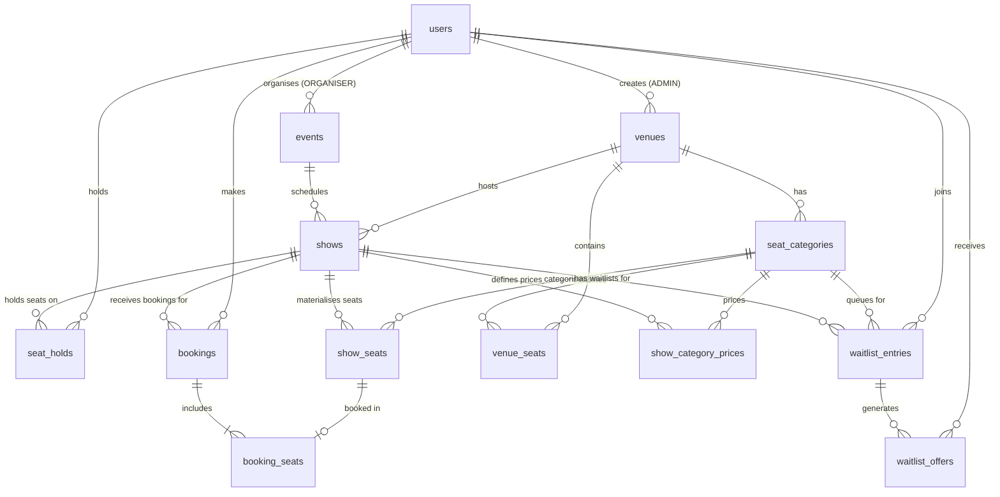

# Database Schema & Entity-Relationship Documentation

The system uses PostgreSQL 15+ with row-level locks, conditional UPDATE predicates, partial unique indexes, and advisory locks for high-concurrency seat holds and waitlist promotions.

---

## Entity-Relationship Diagram

---

## Data Tables Overview

### 1. `users`
Stores user identities and roles. Role enum: `CUSTOMER`, `ORGANISER`, `ADMIN`.

### 2. `venues`
Physical venue definitions (cinemas, stadium arenas) created by administrators.

### 3. `seat_categories`
Category pricing tiers per venue (e.g. Premium, Standard, Economy) with display rank and color codes.

### 4. `venue_seats`
Master physical layout grid for a venue (`row_label`, `seat_number`, `grid_row`, `grid_col`).

### 5. `events`
Listing header for movies or concerts created by event organisers.

### 6. `shows`
Individual screening or concert showtime mapped to an event and venue (`starts_at`, `status`).

### 7. `show_category_prices`
Per-show, per-category pricing rules (`show_id`, `category_id`, `price`).

### 8. `show_seats` ★ (Core Contention Table)
Materialised seat instances generated per show during show creation.
- **Statuses**: `AVAILABLE`, `HELD`, `OFFERED`, `BOOKED`, `BLOCKED`
- **Hold Fields**: `held_by`, `hold_group_id`, `hold_expires_at`
- **Offer Fields**: `offered_to`, `offer_id`, `offer_expires_at`
- **Booking Field**: `booking_id`
- **Constraints**:
  - `uq_show_seat`: `UNIQUE(show_id, venue_seat_id)`
  - `ck_booked_consistency`: `CHECK ((status='BOOKED') = (booking_id IS NOT NULL))`
  - `ck_held_consistency`: `CHECK ((status='HELD') = (hold_expires_at IS NOT NULL))`

### 9. `seat_holds`
Audit trail of seat hold requests, TTL expiration tracking, and conversion status.

### 10. `bookings`
Confirmed ticket bookings containing customer info, total payment, HMAC QR payload, and cancellation timestamps.

### 11. `booking_seats`
Junction table linking confirmed bookings to specific `show_seats`.
- **Database Backstop Constraint**:
  `CREATE UNIQUE INDEX uq_active_booking_seat ON booking_seats (show_seat_id)`
  Guarantees a seat can never be double-booked under any condition.

### 12. `waitlist_entries`
FIFO queue per `show_id + category_id` tracking customers waiting for sold-out seat tiers.
- **Ordering**: `position` (`BIGSERIAL` monotonic queue order).

### 13. `waitlist_offers`
Time-limited seat reservation offers created automatically upon booking cancellation.
- Stores `token_hash` (`sha256`), `expires_at`, and status (`PENDING`, `CLAIMED`, `EXPIRED`).

### 14. `email_log`
Audit log recording email delivery attempts (Resend API provider IDs, status, error trace).
